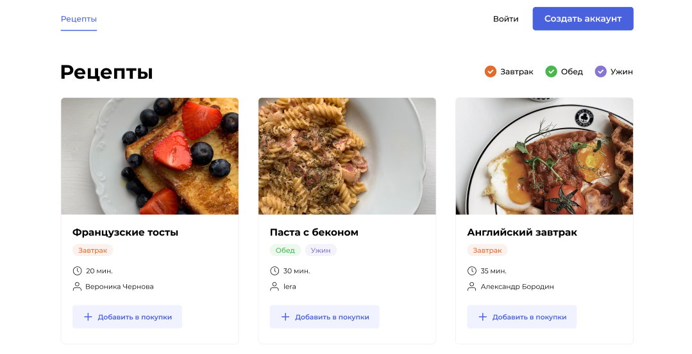

<div align="head">
  
</div>

## :man_technologist: Дипломный проект. 

Сайт, на котором пользователи публикуют рецепты, подписываться на публикации других авторов и добавлять рецепты в избранное.
Возможность формировать список покупок из избранных рецептов.

На проекте отточен навык автоматизации процесса деплоя, на удаленный сервер.
При помощи Git Actions: 


Сайт доступен по адресу [foodgramm.ddns.net](http://foodgramm.ddns.net/)

Документация к API доступна по адресу [foodgramm.ddns.net/api/docs/](http://foodgramm.ddns.net/api/docs/)

### :hammer_and_wrench: Технологии:

<div>
  &nbsp;
  &nbsp;
  &nbsp;
  
  
  
</div>

### Развернуть проект на удаленном сервере:

- Клонировать репозиторий:
```
https://github.com/SlemCool/foodgram-project-react.git
```

- Установить на сервере Docker, Docker-Compose:

- Скопировать на сервер файлы docker-compose.yml, nginx.conf из папки infra (команды выполнять находясь в папке infra):
```
scp docker-compose.yml nginx.conf <username>@<IP>:/home/username/   # username - имя пользователя на сервере
                                                                    # IP - публичный IP сервера
```

- Создать и запустить контейнеры Docker, выполнить команду на сервере
```
sudo docker-compose up -d
```

- После успешной сборки выполнить миграции:
```
sudo docker-compose exec backend python manage.py migrate
```

- Создать суперпользователя:
```
sudo docker-compose exec backend python manage.py createsuperuser
```

- Собрать статику:
```
sudo docker-compose exec backend python manage.py collectstatic --noinput
```

- Наполнить базу данных содержимым из файла ingredients.json:
```
sudo docker compose exec backend python manage.py loaddata ./data/ingredients.json
```
### Готово! :fire:

Автор backend'а:

Кагадий Андрей 2023г.
